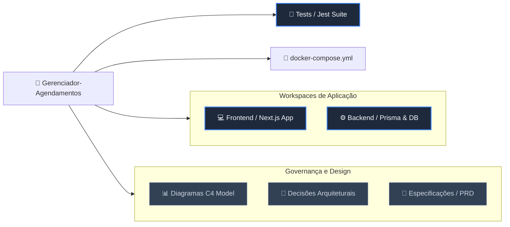

# 📅 Gerenciador de Agendamentos Inteligente (MVP)

Este projeto é uma plataforma autônoma projetada para profissionais liberais (eletricistas, encanadores, etc.). Ele atua como um assistente digital 24/7, permitindo agendamentos independentes, reduzindo tarefas administrativas e eliminando conflitos de agenda ("double-booking").

---

## 🚀 ROTEIRO DE TESTE EM PRODUÇÃO

Para validar a aplicação em tempo real, utilize os acessos abaixo:

### 🧑‍💻 Visão do Cliente (Pública)
**URL:** [👉 projeto-agendamentos-ashen.vercel.app](https://projeto-agendamentos-ashen.vercel.app)

* **Sugestão de Teste:** Tente realizar um agendamento no último horário disponível do dia para validar a trava de *"Time Overflow"* (o sistema impede que um serviço de 2h seja marcado faltando apenas 1h para o fim do expediente).

### 🧑‍🔧 Visão do Profissional (Dashboard Administrativo)
**URL:** [👉 Login do Sistema](https://projeto-agendamentos-ashen.vercel.app/login)
* **Login:** `carlos.eletricista@hotmail.com` | **Senha:** `teste123`

* **Sugestão de Teste:** Clique no botão **"Resumir meu dia com IA"**. O sistema consumirá a API do **Google Gemini** para gerar um briefing de produtividade baseado nos agendamentos reais do banco.

---

## 🛠️ Atendimento aos Requisitos Técnicos (RNFs)

A arquitetura foi desenhada para cumprir integralmente os Requisitos Não Funcionais da disciplina:

* **RNF-01 (Acessibilidade/Portabilidade):** Interface responsiva compatível com navegadores modernos e mobile-first.
* **RNF-02 (Segurança):** Autenticação e Multi-tenancy via **Clerk Auth**, garantindo isolamento total entre profissionais.
* **RNF-03 (Interoperabilidade):** Comunicação entre Frontend e Backend via APIs RESTful e Server Actions seguras.
* **RNF-04 (Observabilidade):** Monitoramento de erros e performance via **Sentry SDK** integrado em toda a stack.
* **RNF-05 (Testabilidade):** Suíte de testes automatizados utilizando **Jest** e **React Testing Library** para validação de lógica de negócio.
* **RNF-06 (Portabilidade/Implantação):** Suporte a contêineres **Docker** e orquestração via **Docker Compose** para evitar vendor lock-in.
* **RNF-07 (Persistência):** Banco de dados relacional **PostgreSQL** hospedado no Supabase, gerenciado via **Prisma ORM**.
* **RNF-08 (Governança):** Versionamento semântico via Git, isolamento de dependências e automação de deploy (CI/CD).

---

## 📦 Estrutura do Repositório (Monorepo)

O projeto utiliza o conceito de **Workspaces** para isolar as camadas da aplicação, facilitando a manutenção e futuras migrações de infraestrutura.

---

## 🤖 Suporte de Inteligência Artificial

A IA foi utilizada de forma bimodal neste projeto:
1.  **Feature de Produto:** Implementação de LLM (Gemini) para análise preditiva da agenda do profissional.
2.  **Apoio à Engenharia:** Pair programming para refatoração de algoritmos de intersecção de horários e geração de documentação técnica.
📄 **[Confira os Prompts e Evidências aqui](./docs/ai_prompts.md)**

---

## 💻 Como Reproduzir Localmente

### Opção 1: Node.js Nativo
1.  Instale as dependências: `npm install`
2.  Configure as variáveis no `.env` (conforme `.env.example`).
3.  Prepare o Banco: `npx prisma generate` && `npx prisma db push`
4.  **Testar:** `npm test` (Executa a suíte de testes do RNF-05)
5.  **Rodar:** `npm run dev`

### Opção 2: Docker Compose (RNF-06)
1.  Certifique-se de que o Docker está rodando.
2.  Execute: `docker-compose up -d --build`
3.  Acesse: `http://localhost:3000`

---
*Este projeto é parte integrante da avaliação da disciplina de Desenvolvimento Full Stack.*