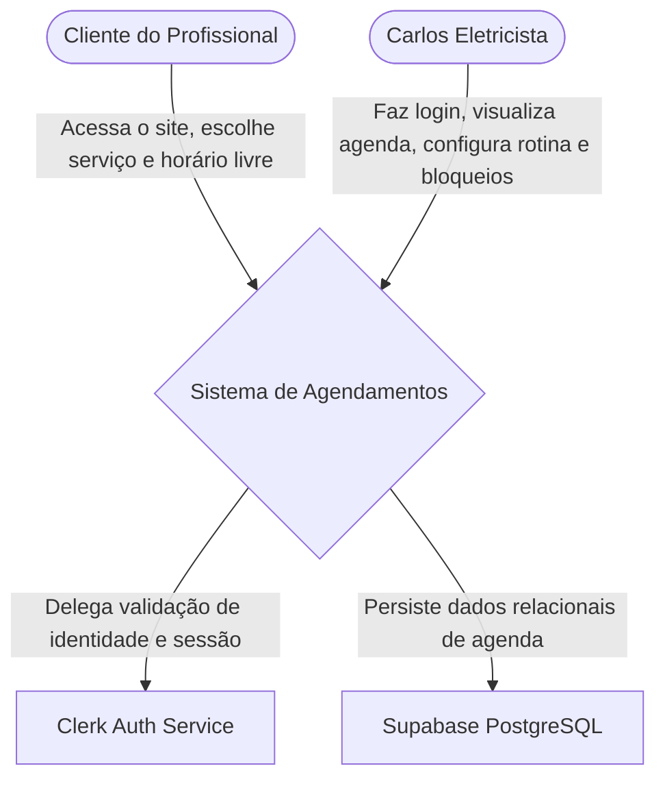
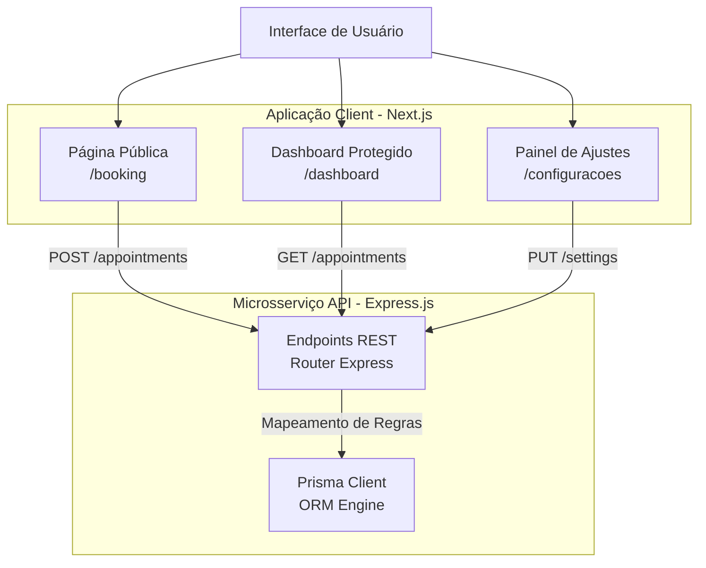
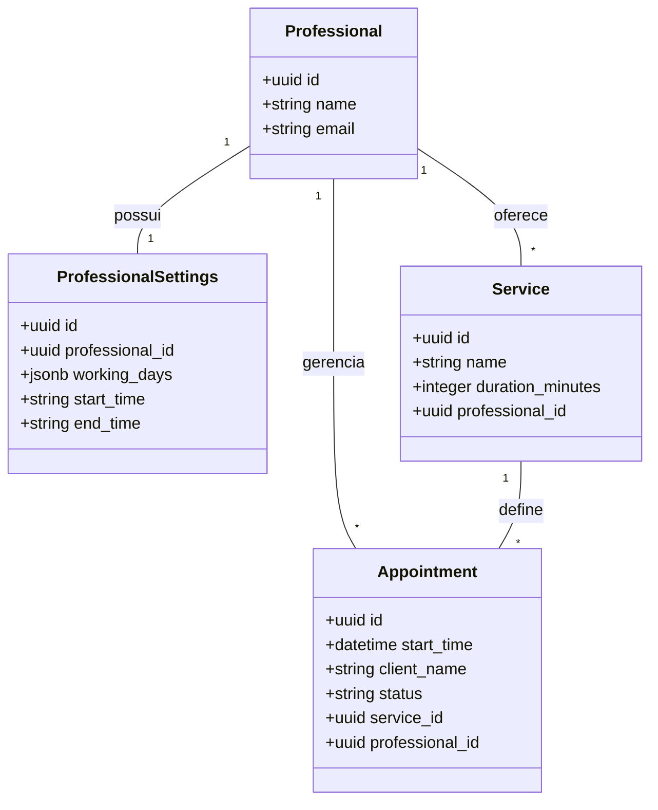

# C4 Model - Gerenciador de Agendamentos

# Arquitetura do Sistema - Gerenciador de Agendamentos

Abaixo estão as representações arquiteturais do sistema, utilizando diagramas Mermaid para mapear desde o contexto geral até o deployment, refletindo a stack tecnológica definitiva e a arquitetura de microsserviços Serverless na nuvem (Next.js, Node/Express, Prisma, Clerk e Supabase PostgreSQL).

---

## 1. Diagrama de Contexto

Ilustra como os usuários interagem com o sistema em alto nível e as dependências externas da plataforma.



## 2. Diagrama de Contêineres

Detalha a separação de responsabilidades (Microsserviços) entre o Frontend e a API, ambos operando na infraestrutura Serverless.

```mermaid
flowchart TD
    Usuarios([Usuários: Cliente e Profissional])
    
    subgraph Vercel [Hospedagem Serverless - Vercel]
        Frontend[Frontend Next.js\nReact, TailwindCSS]
        Backend[Backend API Node.js\nExpress.js, Prisma ORM]
    end
    
    subgraph ClerkCloud [Serviço de Identidade]
        Auth[Clerk Auth]
    end

    subgraph Supabase [Backend as a Service - Supabase]
        DB[(Banco de Dados\nPostgreSQL)]
    end

    Usuarios -->|HTTPS| Frontend
    Frontend -->|Proteção de Rotas via Middleware| Auth
    Frontend -->|Requisições HTTP REST (CORS)| Backend
    Backend -->|Validação de Token JWT| Auth
    Backend -->|Consultas seguras via Pooler TCP| DB
```

## 3. Diagrama de Componentes

Foca na estrutura interna separada entre a Aplicação Web (Apresentação) e a API Node.js (Regra de Negócio e Persistência).



## 4. Diagrama de Banco de Dados (ERD)

Detalha a estrutura relacional no PostgreSQL, destacando a estratégia Multi-Tenant e a gestão de rotina.



## 5. Diagrama de Deployment

Ilustra a infraestrutura de nuvem distribuída onde os microsserviços rodam em produção, demonstrando a pipeline automatizada.

```mermaid
flowchart TD
    Navegador([Navegador Web do Cliente/Profissional])
    
    subgraph CloudVercel [Vercel Infrastructure]
        NextApp[Frontend: Edge Network SSR/SSG]
        NodeApp[Backend: Node.js Serverless Functions]
    end

    subgraph CloudClerk [Clerk Cloud Infrastructure]
        AuthSvc[Gestão de Sessão B2B/B2C]
    end
    
    subgraph CloudSupabase [Supabase Cloud AWS]
        Postgres[(PostgreSQL Transactional)]
    end

    Navegador -->|Tráfego Público HTTPS| NextApp
    NextApp -->|Consumo de API interna| NodeApp
    NextApp -->|Geração de Sessão| AuthSvc
    NodeApp -->|Verificação de Autenticidade| AuthSvc
    NodeApp -->|Conexão TCP/IPv4 (rhel-openssl)| CloudSupabase
    CloudSupabase --> Postgres
```