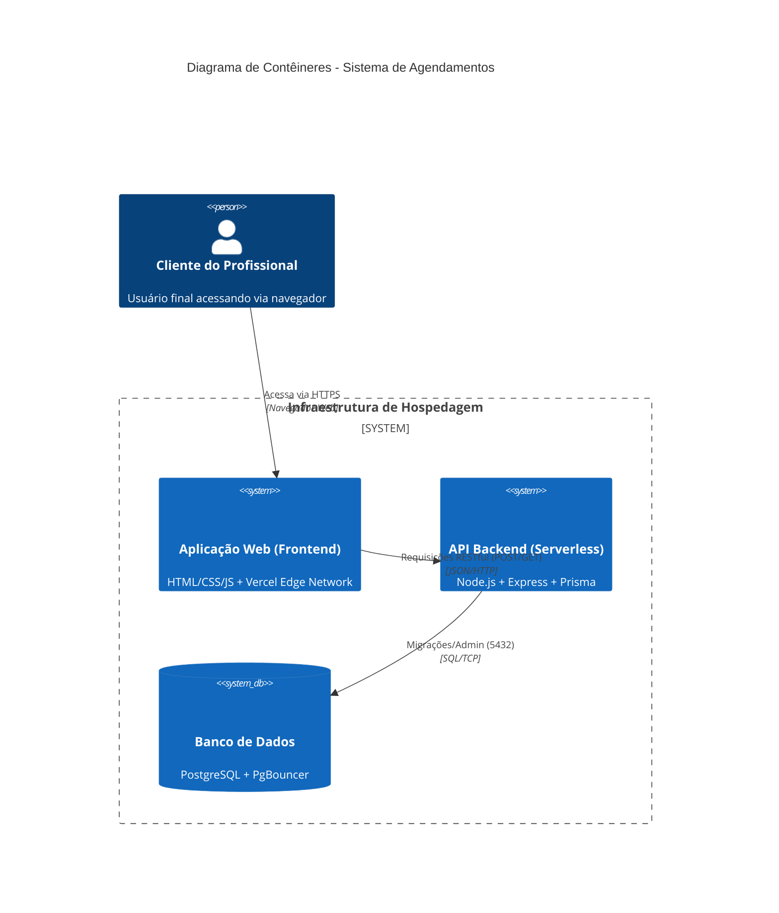

# C4 Model - Gerenciador de Agendamentos

Abaixo está a representação arquitetural do sistema baseada no modelo C4 (Níveis 1 e 2).

## Nível 1: Diagrama de Contexto (System Context)

O diagrama de contexto mostra como o sistema se encaixa no mundo ao seu redor.

```text
[ Cliente do Profissional ] 
        |
        | (Acessa o site, escolhe serviço e horário)
        v
[ Sistema de Agendamentos ] <--- (Gerencia horários, serviços e profissionais)
        |
        | (Lê e grava dados persistentes)
        v
[ Banco de Dados Relacional ]```


## Nível 2: Diagrama de Contêineres (Container Diagram)

O diagrama de contêineres detalha as tecnologias e aplicações que compõem o sistema.



### Descrição dos Componentes (Contêineres)

1. [ Aplicação Web / Frontend ]
   - Responsabilidade: Renderizar a interface de usuário, calendário e formulários.
   - Tecnologia: HTML/CSS/JS (Hospedado via Vercel).
   - Comunicação: Faz requisições HTTP RESTful para a API.

2. [ API Backend (Serverless) ]
   - Responsabilidade: Receber as requisições, validar regras de negócio e comunicar com o banco de dados.
   - Tecnologia: Node.js, Express, Prisma ORM.
   - Hospedagem: Vercel Serverless Functions.
   - Comunicação: Conecta-se ao banco via Connection Pool (PgBouncer).

3. [ Banco de Dados ]
   - Responsabilidade: Armazenamento seguro e relacional dos clientes, agendamentos, profissionais e serviços.
   - Tecnologia: PostgreSQL (Hospedado no Supabase).
1. [ Aplicação Web / Frontend ]
   - Responsabilidade: Renderizar a interface de usuário, calendário e formulários.
   - Tecnologia: HTML/CSS/JS (Hospedado via Vercel).
   - Comunicação: Faz requisições HTTP RESTful para a API.

2. [ API Backend (Serverless) ]
   - Responsabilidade: Receber as requisições, validar regras de negócio e comunicar com o banco de dados.
   - Tecnologia: Node.js, Express, Prisma ORM.
   - Hospedagem: Vercel Serverless Functions.
   - Comunicação: Conecta-se ao banco via Connection Pool (PgBouncer).

3. [ Banco de Dados ]
   - Responsabilidade: Armazenamento seguro e relacional dos clientes, agendamentos, profissionais e serviços.
   - Tecnologia: PostgreSQL (Hospedado no Supabase).