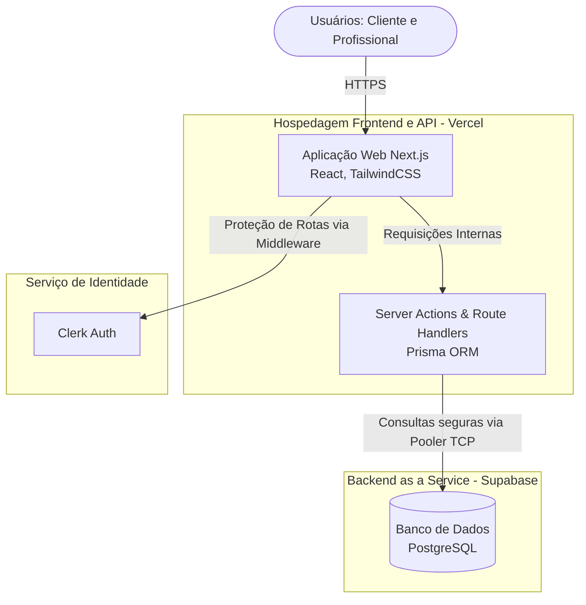
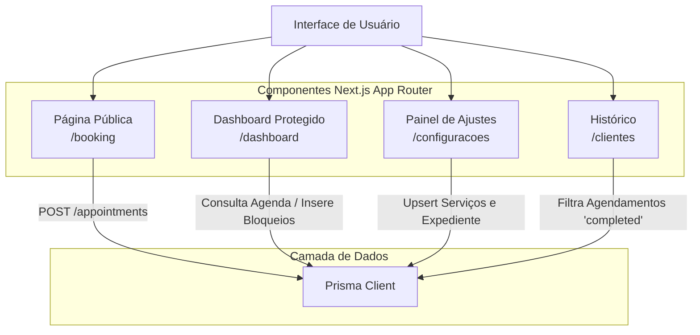
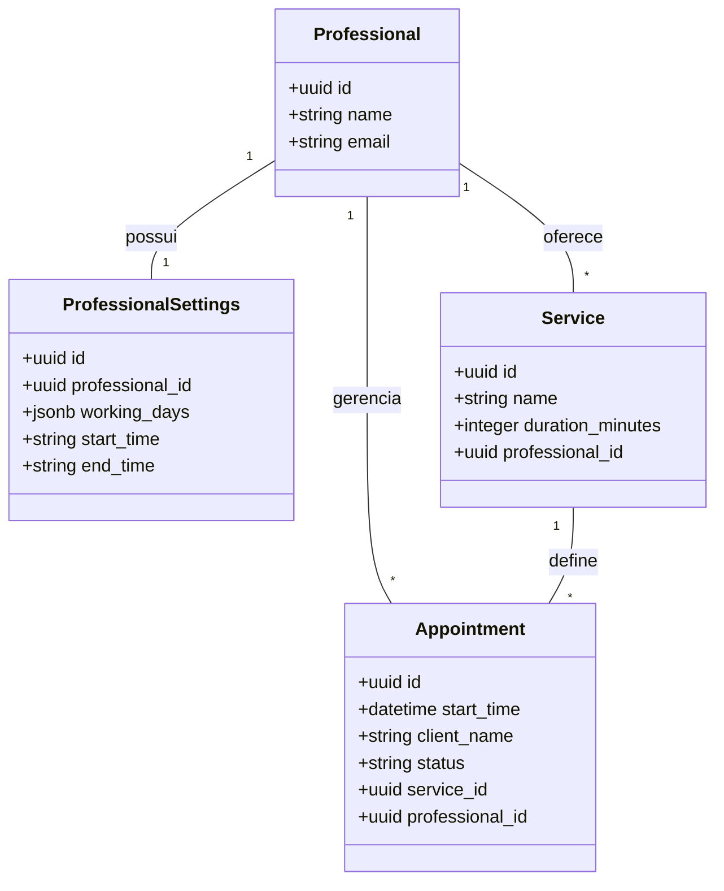
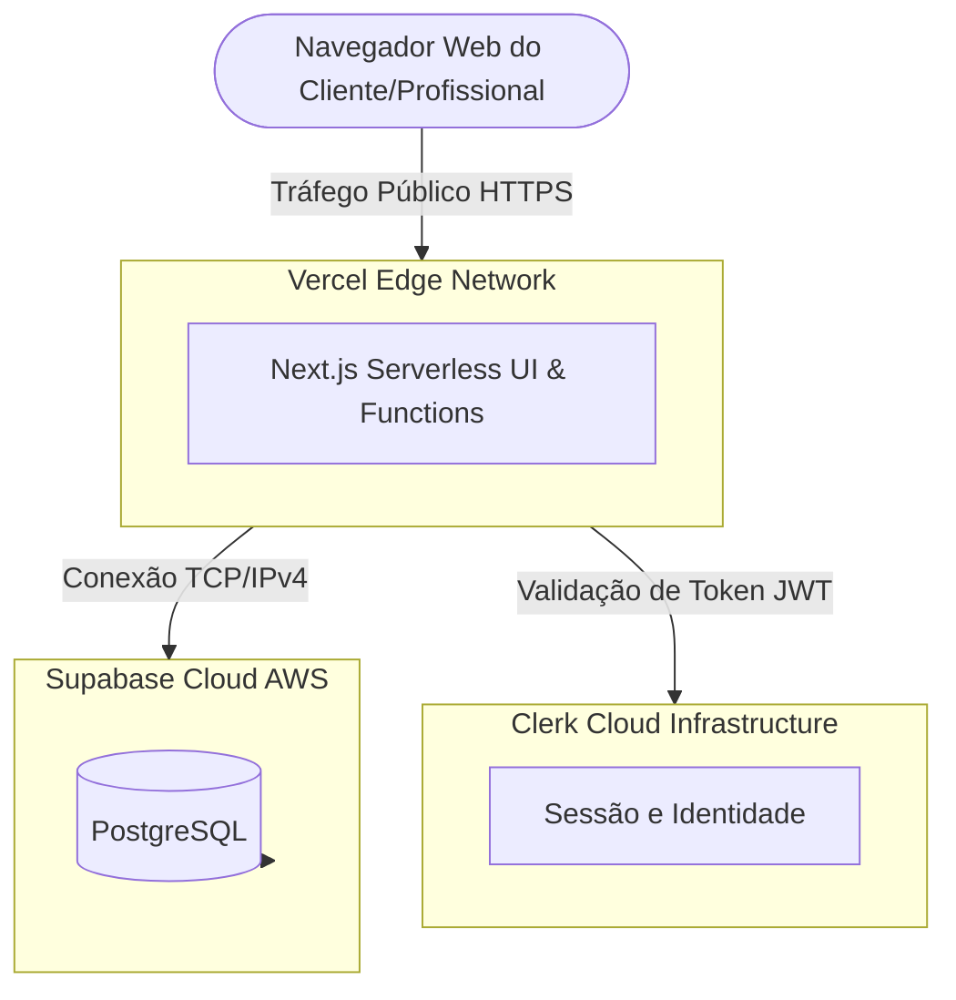

# C4 Model - Gerenciador de Agendamentos

# Arquitetura do Sistema - Gerenciador de Agendamentos

Abaixo estão as representações arquiteturais do sistema, utilizando diagramas Mermaid para mapear desde o contexto geral até o deployment, refletindo a stack tecnológica definitiva do MVP (Next.js, Prisma, Clerk e Supabase PostgreSQL).

---

## 1. Diagrama de Contexto

Ilustra como os usuários interagem com o sistema em alto nível e as dependências externas da plataforma.

## 2. Diagrama de Contêineres

Detalha as principais tecnologias e serviços utilizados na arquitetura Serverless.

## 3. Diagrama de Componentes

Foca na estrutura interna da Aplicação Web e na comunicação com o banco de dados via ORM.

## 4. Diagrama de Banco de Dados (ERD)

Detalha a estrutura relacional no PostgreSQL, destacando a estratégia Multi-Tenant e a gestão de rotina.

## 5. Diagrama de Deployment

Ilustra a infraestrutura física/cloud distribuída onde o sistema roda em produção.

