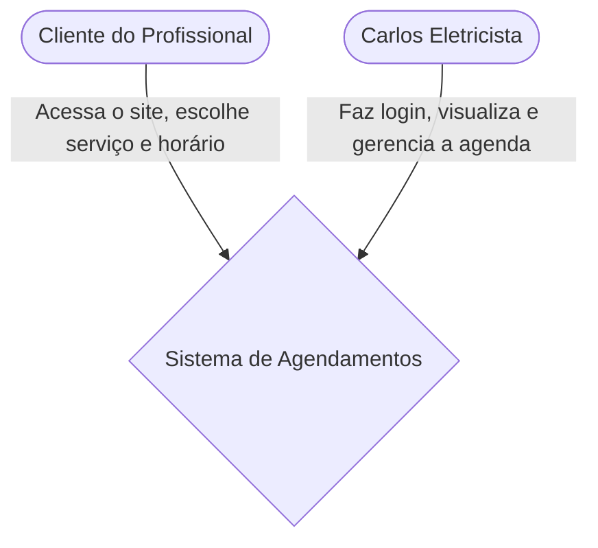
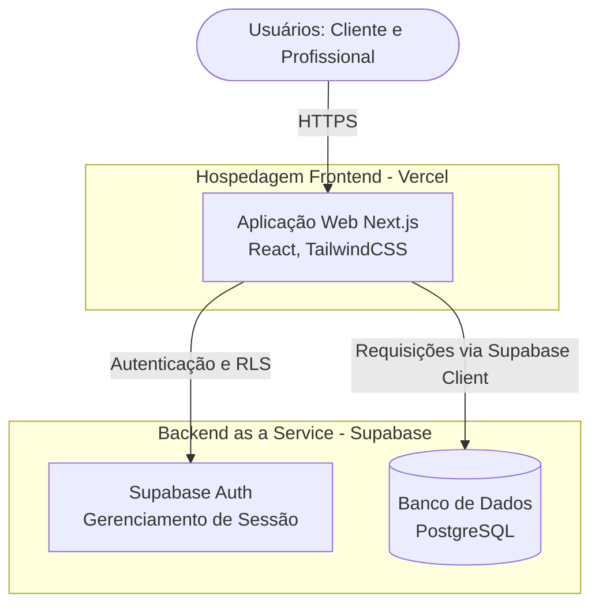
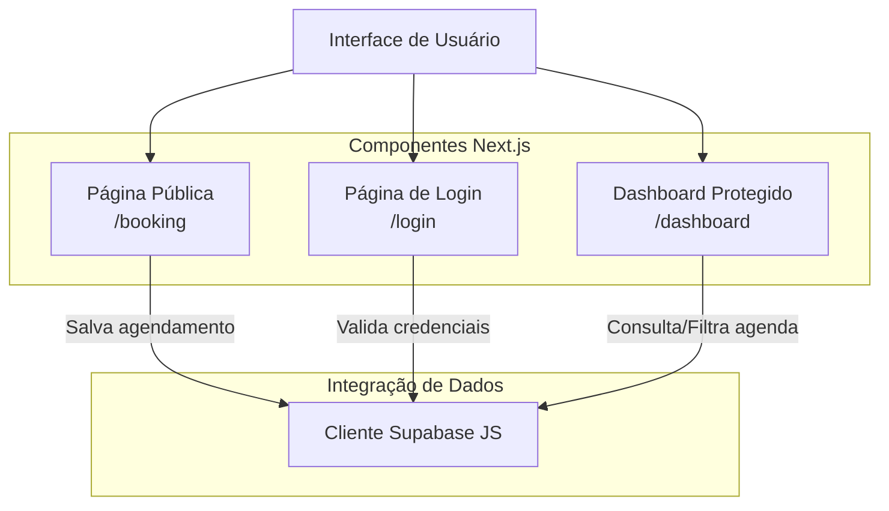
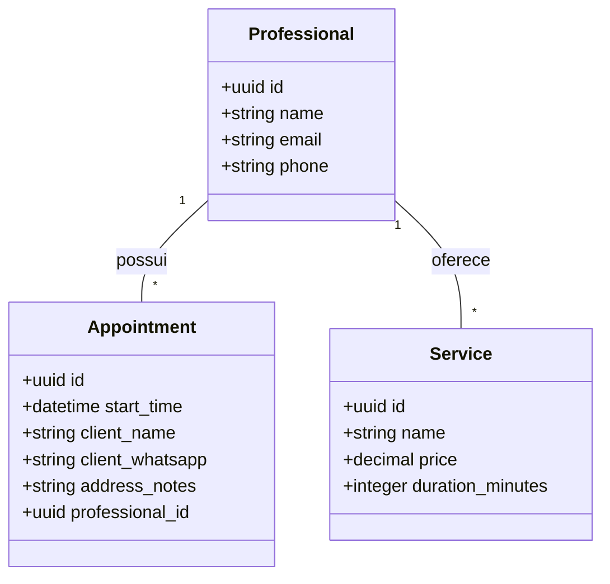
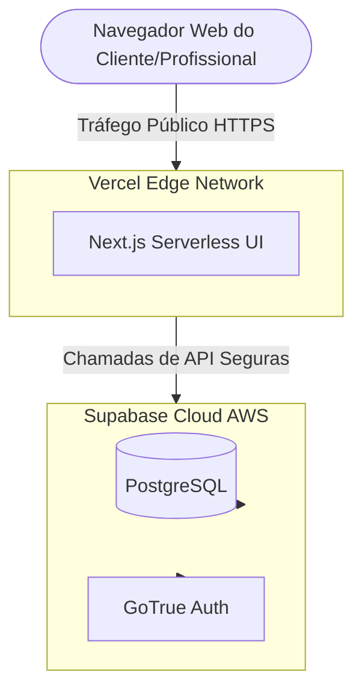

# C4 Model - Gerenciador de Agendamentos

# Arquitetura do Sistema - Gerenciador de Agendamentos

Abaixo estão as representações arquiteturais do sistema, utilizando diagramas Mermaid para mapear desde o contexto geral até o deployment, refletindo a stack tecnológica atual (Next.js e Supabase).

---

## 1. Diagrama de Contexto

Ilustra como os usuários interagem com o sistema em alto nível.

## 2. Diagrama de Contêineres

Detalha as principais tecnologias e serviços utilizados na arquitetura.

## 3. Diagrama de Componentes

Foca na estrutura interna da Aplicação Web (Frontend)

## 4. Diagrama de Banco de Dados

Detalha a estrutura das tabelas e relacionamentos no PostgreSQL.

## 5. Diagrama de Deployment

Ilustra a infraestrutura física/cloud onde o sistema roda.

