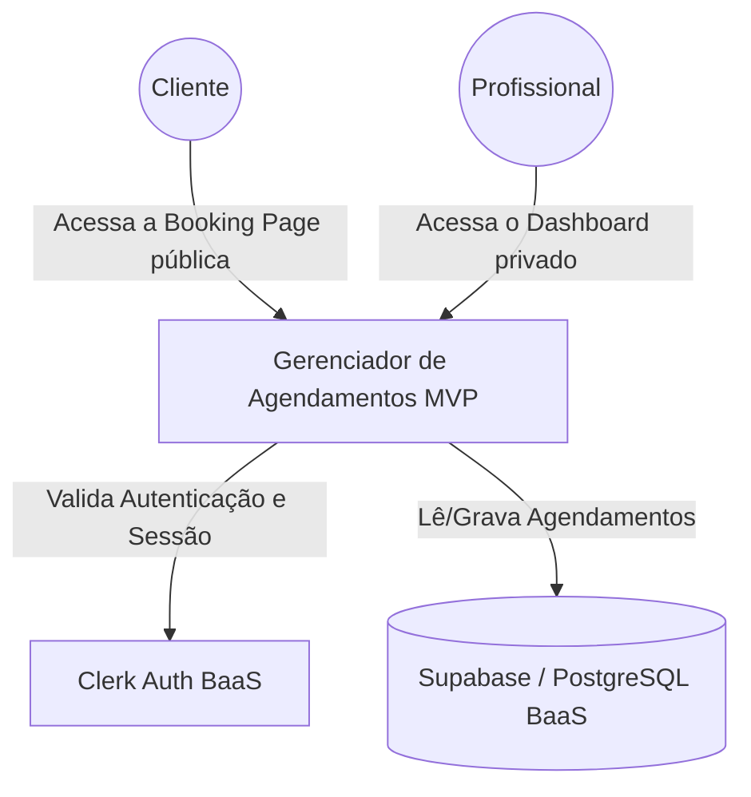
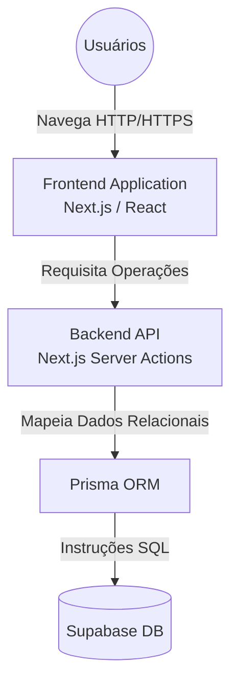
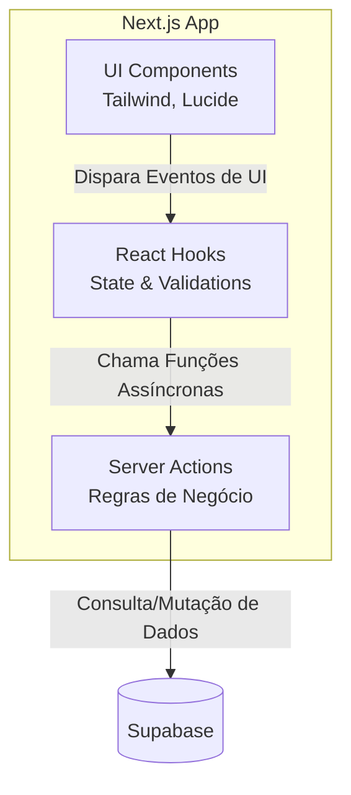
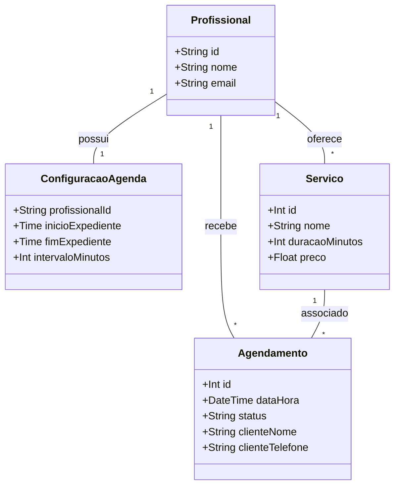
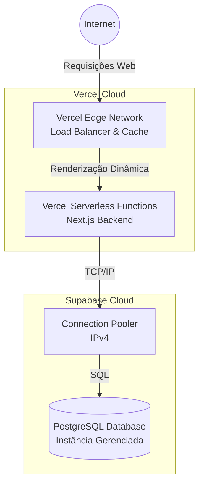

# Diagramas de Arquitetura do Sistema

Os diagramas abaixo detalham a arquitetura do "Gerenciador de Agendamentos Inteligente" em diferentes níveis de abstração, utilizando a notação padrão da disciplina.

## 1. Diagrama de Contexto
*Identifica o sistema principal, os atores envolvidos e os sistemas externos (BaaS).*

## 2. Diagrama de Contêineres
*Demonstra as responsabilidades do frontend, lógica de backend (Server Actions) e persistência.*

## 3. Diagrama de Componentes
*Detalha a organização interna do contêiner da aplicação, demonstrando baixo acoplamento.*

## 4. Diagrama de Classes
*Representa o domínio do problema, as entidades principais e seus relacionamentos lógicos no banco.*

## 5. Diagrama de Deployment
*Mostra a topologia de infraestrutura, escalabilidade e distribuição na nuvem.*

