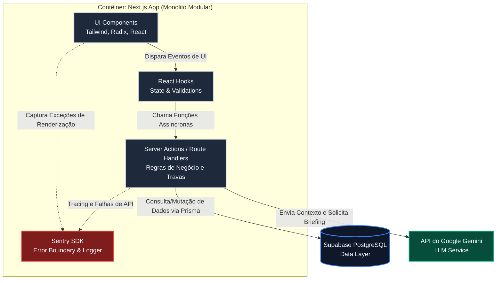

# Diagrama de Componentes (Nível 3)

Este diagrama detalha a organização interna do contêiner da aplicação Next.js, demonstrando o fluxo de dados, o baixo acoplamento e a integração com os serviços de monitoramento e inteligência artificial adotados no MVP.

> **Notas Arquiteturais:**
> * **Server Actions:** Atuam como a camada controladora, isolando as regras de negócio complexas (como a trava de *double-booking*) e protegendo as credenciais de APIs de terceiros (como a chave do Gemini).
> * **Sentry SDK:** Funciona como um *Observer* passivo. As linhas pontilhadas indicam que a captura de erros e o rastreamento de performance ocorrem em rotinas de background, garantindo que falhas de telemetria não afetem a responsividade da interface do usuário.