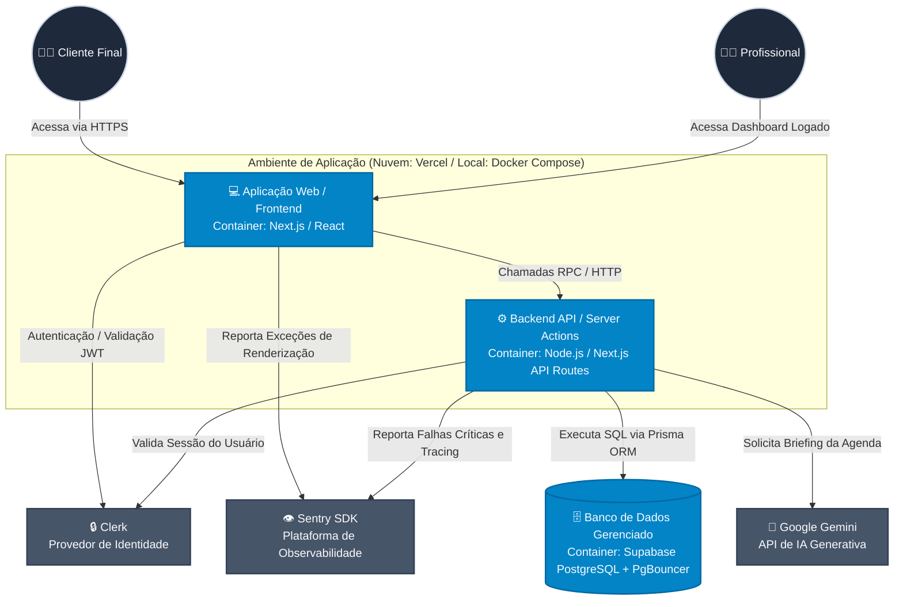

# Diagrama de Contêineres (Nível 2)

Este diagrama demonstra a arquitetura em nível de contêineres (unidades implantáveis), ilustrando as responsabilidades da aplicação web, o ambiente de execução (Docker/Vercel) e as integrações com serviços de terceiros (SaaS) que compõem o ecossistema.

> **Notas Arquiteturais:**
> * **Docker e Portabilidade:** Conforme definido no RNF-06, a aplicação e suas dependências são containerizadas via Docker (orquestradas via `docker-compose`) para garantir a paridade entre o ambiente de desenvolvimento local e a infraestrutura de produção Serverless (Vercel).
> * **Connection Pooling:** O acesso ao banco de dados pelo contêiner da API é intermediado pelo `PgBouncer` nativo do Supabase, evitando o esgotamento de conexões inerente a arquiteturas Serverless.