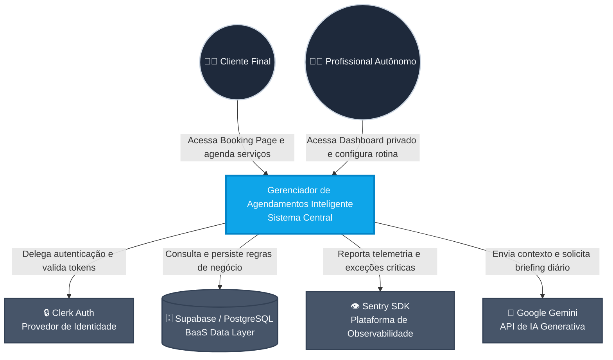

# Diagrama de Contexto (Nível 1)

Este diagrama identifica o sistema principal do Gerenciador de Agendamentos Inteligente, as personas envolvidas e os sistemas externos (SaaS/BaaS) com os quais a plataforma se comunica para entregar valor e segurança.

> **Visão de Negócio:**
> O sistema atua como o orquestrador central da operação do profissional autônomo. Ele retira a carga operacional do usuário ao delegar responsabilidades pesadas para ferramentas de ponta do mercado: a segurança fica com o Clerk, o armazenamento elástico com o Supabase, o monitoramento preventivo com o Sentry e a análise inteligente da rotina com a IA do Google Gemini.