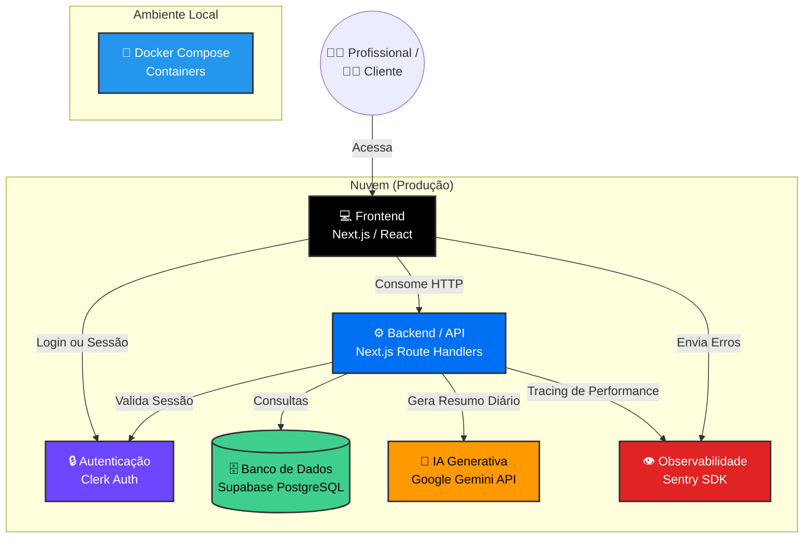

# Especificação Técnica

## 1. Visão Geral Técnica e Arquitetura em Alto Nível
A presente Especificação Técnica do Produto estabelece as diretrizes arquiteturais, stack tecnológica padrão e regras de segurança para o desenvolvimento do **Gerenciador de Agendamentos Inteligente (MVP - v1)**. 

O objetivo deste documento é servir como um guia definitivo para o desenvolvimento, garantindo consistência, escalabilidade e manutenção facilitada do código através de uma arquitetura moderna e segura baseada em microsserviços na nuvem.

O sistema opera sob o ecossistema **Jamstack / Serverless**, dividindo as responsabilidades em três pilares: a interface de usuário (Frontend), as regras de negócio distribuídas em funções sob demanda (Backend/Serverless), e os provedores gerenciados (BaaS/SaaS) para autenticação, banco de dados e inteligência artificial.

---

## 2. Arquitetura de Referência (C4 Model)

A aplicação adota uma arquitetura híbrida focada em agilidade e padronização, operando sob o estilo **Monolito Modular Serverless**:
- **Desenvolvimento Local:** Utiliza **Docker e Docker Compose** para orquestração de serviços, garantindo paridade de ambiente entre desenvolvedores.
- **Produção (Stable/Preview):** Utiliza arquitetura **Serverless PaaS na Vercel**, visando escalabilidade total e eliminação de manutenção de infraestrutura.

A estrutura é baseada no modelo de **Recipientes (Containers/Serviços)**, com separação clara:

* **Componentes Principais:**
    * **Client Layer (Frontend):** Aplicação Next.js consumindo API via HTTP. Renderização híbrida (SSR para a booking page, CSR para o Dashboard).
    * **Data/API Layer (Backend):** Servidor Node.js rodando nativamente via Next.js Route Handlers, operando como Serverless Functions na Vercel.
    * **Auth Service (Clerk):** Serviço gerenciado responsável pela emissão de tokens (JWT) e segurança da sessão.
    * **Database Provider (Supabase):** Banco de dados relacional (PostgreSQL) gerenciado na nuvem.
    * **AI Layer (Gemini):** Integração com Google Gemini LLM para interpretação de dados e geração de resumos de agenda.
    * **Ambiente de Containerização (Docker):** A orquestração local via docker-compose garante a portabilidade do sistema (atendendo ao RNF-06), encapsulando dependências em uma imagem OCI.

### Especificidades de Infraestrutura na Nuvem
* **Comunicação Cross-Origin:** A API do Backend possui políticas estritas configuradas para aceitar requisições exclusivamente do domínio de produção do Frontend.
* **Compatibilidade de Banco de Dados:** O Prisma ORM está configurado com `binaryTargets` específicos (`rhel-openssl-3.0.x`) para execução na Vercel.

---

## 3. Stack Tecnológica

### Frontend
* **Linguagem:** TypeScript
* **Framework web:** Next.js 14+ (React)
* **Estilização:** Tailwind CSS (Abordagem Utility-first / Mobile-First).

### Backend e Persistência
* **Linguagem:** TypeScript
* **Runtime:** Node.js (Vercel Serverless Functions).
* **Framework API:** Next.js Route Handlers.
* **Persistência:** PostgreSQL (Supabase).
* **ORM:** Prisma ORM.

### Testes e Qualidade (RNF-05)
* **Framework de Testes:** Jest.
* **Validação de Interface:** React Testing Library e Jest DOM.
* **Objetivo:** Garantir testabilidade de funções críticas (ex: formatadores de data/hora e lógicas de concorrência), prevenindo regressões de código.

### Inteligência Artificial
* **LLM API:** Google Gemini (Generative AI). *Utilizado de forma assíncrona no backend para analisar os compromissos do dia e retornar um "briefing" natural e humanizado para o profissional.*

### Stack de Desenvolvimento e DevOps
* **IDE:** VS Code.
* **Pipeline CI/CD:** GitHub Actions.
* **Hospedagem de Produção:** Vercel.
* **Ambiente de Desenvolvimento Local:** Docker & Docker Compose.

---

## 4. Segurança e Observabilidade

### Autenticação e Gestão de Sessão
A aplicação delega a gestão de identidade ao **Clerk**, armazenando o ID único gerado (`professional_id`) no banco de dados Supabase. Em cada requisição, o backend valida o token JWT do Clerk.

### Segurança de Dados e Transações
* **Criptografia:** Todo tráfego é HTTPS/TLS nativo da Vercel.
* **Prevenção de Concorrência (Double Booking):** As rotas de criação de agendamento possuem travas de banco de dados (`SELECT` prévio) que validam e barram requisições simultâneas para o mesmo slot de horário, retornando código `409 Conflict`.

### Observabilidade e Rastreabilidade (RNF-04)
A dependência exclusiva de logs nativos da Vercel foi substituída por uma ferramenta de nível corporativo:
* **Sentry SDK:** Configurado no projeto e integrado à pipeline CI/CD (com envio de *Source Maps*). O Sentry monitora automaticamente a aplicação em tempo real, capturando exceções (*Error Tracking*) e medindo a latência de chamadas à API de agendamentos e banco de dados (*Distributed Tracing*).

---

## 5. APIs e Comunicação
A comunicação entre Cliente e Servidor segue o padrão REST via Next.js Route Handlers.

### Endpoints Principais
* `POST /api/appointments`: Criação de novos agendamentos (clientes) com validação de *double booking*.
* `GET /api/appointments`: Recuperação da lista de compromissos filtrada por data e profissional.
* `GET /api/health`: Rota de verificação de status e integridade do Backend.

---

## 6. Tenancy
* **Estratégia:** Arquitetura *Multi-Tenant* (Single Database, Shared Schema).
* **Isolamento:** A separação lógica é feita via `professional_id`.
* **Segurança:** Filtros obrigatórios em todas as queries SQL/Prisma baseados na identidade do profissional logado.

---

## 7. Modelo de Dados (ERD)

---

## 8. Diretrizes para Desenvolvimento Assistido por IA
1.  **Tipagem Estrita:** A IA deve sempre gerar interfaces TypeScript e evitar o tipo genérico `any`.
2.  **Modularização:** Manter componentes de interface separados da lógica de acesso ao banco de dados.
3.  **Sincronia com PRD:** Toda nova implementação sugerida pela IA deve ser validada contra os requisitos definidos no documento de PRD.