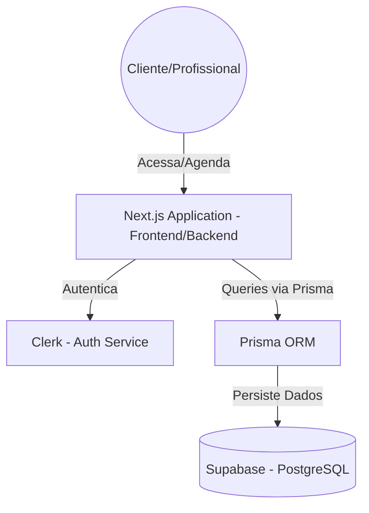
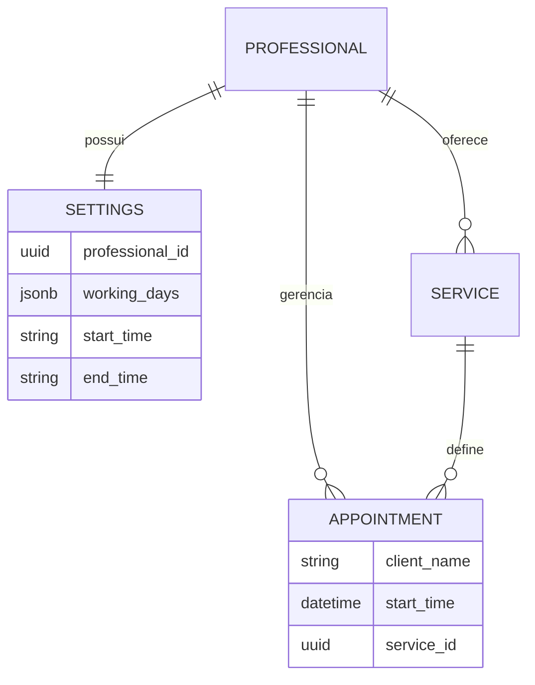

# Especificação Técnica

## 1. Visão Geral Técnica
A presente Especificação Técnica do Produto estabelece as diretrizes arquiteturais, stack tecnológica padrão e regras de segurança para o desenvolvimento do **Gerenciador de Agendamentos Inteligente (MVP - v1)**. 

O objetivo deste documento é servir como um guia definitivo para o desenvolvimento, garantindo consistência, escalabilidade e manutenção facilitada do código através de uma arquitetura moderna e segura.

---

## 2. Arquitetura de Referência (C4 Model)

A aplicação adota uma arquitetura baseada no modelo de **Recipientes (Containers)**, focada no ecossistema **Serverless/Jamstack**:

* **Estilo Arquitetural:** Monorepo Serverless.
* **Componentes Principais:**
    * **Client Layer:** Renderização híbrida (SSR para a booking page, CSR para o Dashboard).
    * **Data/API Layer:** Server Functions e Route Handlers (Next.js).
    * **Database Provider:** Banco de dados relacional gerenciado (Supabase).
* **Infraestrutura de Deployment:** Deploy automatizado via Vercel conectado ao GitHub.

---

## 3. Stack Tecnológica

### Frontend
* **Linguagem:** TypeScript
* **Framework web:** Next.js 14+ (React)
* **Estilização:** Tailwind CSS (Mobile-First)

### Backend e Persistência
* **Linguagem:** TypeScript
* **Runtime:** Node.js (Vercel Serverless Functions)
* **Framework:** Next.js (App Router)
* **Persistência:** PostgreSQL (Supabase)
* **ORM:** Prisma ORM

### Stack de Desenvolvimento
* **IDE:** VS Code
* **Gerenciamento de pacotes:** npm
* **Infraestrutura como Código (IaC):** Terraform para provisionamento de recursos.
* **Pipeline CI/CD:** Vercel Git Integration.

---

## 4. Segurança

### Autenticação e Gestão de Sessão
A aplicação delega a gestão de identidade ao **Clerk**, garantindo fluxos seguros de login (incluindo Google Auth) e proteção de rotas administrativas via Middleware.

### Controle de Acesso e Autorização 
O isolamento de dados é garantido pela chave **professional_id**. O sistema valida em cada requisição se o usuário autenticado possui permissão para acessar ou modificar os registros solicitados.

### Segurança de Dados e Validação
* **Criptografia:** Todo tráfego é criptografado via HTTPS/TLS. Dados em repouso são protegidos pela infraestrutura do Supabase.
* **Sanitização:** Uso de tipos estritos em TypeScript para prevenir inconsistências e validação de esquemas no recebimento de dados.

---

## 5. APIs e Comunicação
A comunicação entre Cliente e Servidor segue o padrão REST.

### Endpoints Principais
* `POST /api/appointments`: Criação de novos agendamentos (clientes) e inserção de bloqueios manuais (profissional).
* `GET /api/appointments`: Recuperação da lista de compromissos filtrada por data e profissional.
* `GET /api/services`: Listagem dinâmica do catálogo de serviços do prestador.

---

## 6. Tenancy
* **Estratégia:** Arquitetura *Multi-Tenant* (Single Database, Shared Schema).
* **Isolamento:** A separação lógica é feita via `professional_id`. O sistema foi projetado para que cada profissional gerencie apenas sua própria grade, sem interferência em outros perfis.
* **Segurança:** Filtros obrigatórios em todas as queries SQL/Prisma baseados na identidade do profissional logado.

---

## 7. Modelo de Dados (ERD)

---

## 8. Diretrizes para Desenvolvimento Assistido por IA
1.  **Tipagem Estrita:** A IA deve sempre gerar interfaces TypeScript e evitar o tipo `any`.
2.  **Modularização:** Manter componentes de interface separados da lógica de acesso ao banco de dados.
3.  **Sincronia com PRD:** Toda nova implementação sugerida pela IA deve ser validada contra os requisitos definidos no documento de PRD.