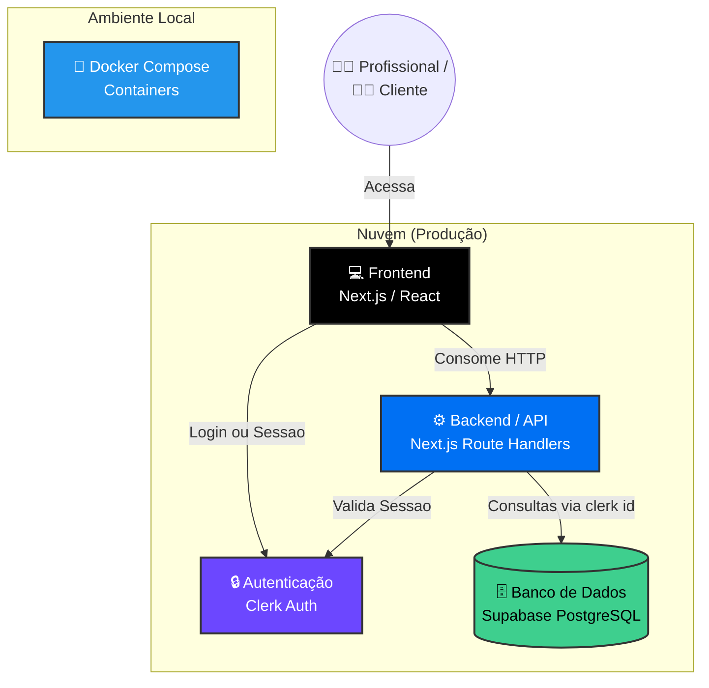

# Especificação Técnica

## 1. Visão Geral Técnica e Arquitetura em Alto Nível
A presente Especificação Técnica do Produto estabelece as diretrizes arquiteturais, stack tecnológica padrão e regras de segurança para o desenvolvimento do **Gerenciador de Agendamentos Inteligente (MVP - v1)**. 

O objetivo deste documento é servir como um guia definitivo para o desenvolvimento, garantindo consistência, escalabilidade e manutenção facilitada do código através de uma arquitetura moderna e segura baseada em microsserviços na nuvem.

O sistema opera sob o ecossistema **Jamstack / Serverless**, dividindo as responsabilidades em três pilares: a interface de usuário (Frontend), as regras de negócio distribuídas em funções sob demanda (Backend/Serverless), e os provedores gerenciados (BaaS) para autenticação e banco de dados.

---

## 2. Arquitetura de Referência (C4 Model)

A aplicação adota uma arquitetura híbrida focada em agilidade e padronização, operando sob o estilo **Monolito Modular Serverless**:
- **Desenvolvimento Local:** Utiliza **Docker e Docker Compose** para orquestração de serviços, garantindo paridade de ambiente entre desenvolvedores.
- **Produção (Stable/Preview):** Utiliza arquitetura **Serverless PaaS na Vercel**, visando escalabilidade total e eliminação de manutenção de infraestrutura.

A estrutura é baseada no modelo de **Recipientes (Containers/Serviços)**, com separação clara:

* **Componentes Principais:**
    * **Client Layer (Frontend):** Aplicação Next.js consumindo API via HTTP. Renderização híbrida (SSR para a booking page, CSR para o Dashboard).
    * **Data/API Layer (Backend):** Servidor Node.js rodando nativamente via Next.js Route Handlers, operando como Serverless Functions na Vercel.
    * **Auth Service (Clerk):** Serviço gerenciado responsável pela emissão de tokens (JWT) e segurança da sessão.
    * **Database Provider (Supabase):** Banco de dados relacional (PostgreSQL) gerenciado na nuvem.
* **Infraestrutura de Deployment:** CI/CD automatizado via GitHub Actions realizando o deploy integrado para a Vercel.

### Especificidades de Infraestrutura na Nuvem
* **Comunicação Cross-Origin:** A API do Backend possui políticas estritas configuradas para aceitar requisições exclusivamente do domínio de produção do Frontend.
* **Compatibilidade de Banco de Dados:** O Prisma ORM está configurado com `binaryTargets` específicos (`rhel-openssl-3.0.x`) para garantir a execução e compatibilidade do Query Engine no ambiente Linux Serverless da Vercel.

---

## 3. Stack Tecnológica

### Frontend
* **Linguagem:** TypeScript
* **Framework web:** Next.js 14+ (React)
* **Estilização:** Tailwind CSS (Abordagem Utility-first / Mobile-First). *Justificada pela velocidade de desenvolvimento e facilidade na componentização.*

### Backend e Persistência
* **Linguagem:** TypeScript
* **Runtime:** Node.js (Vercel Serverless Functions). *Justificado pela escalabilidade sob demanda e ausência de custos ociosos de servidor.*
* **Framework API:** Next.js Route Handlers.
* **Persistência:** PostgreSQL (Fornecido pelo Supabase).
* **ORM:** Prisma ORM. *Justificado por fornecer tipagem estrita de ponta a ponta integrando o banco ao TypeScript.*

### Stack de Desenvolvimento e DevOps
* **IDE:** VS Code.
* **Gerenciamento de pacotes:** npm.
* **Pipeline CI/CD:** GitHub Actions (Scripts customizados de deploy para Vercel).
* **Hospedagem de Produção:** Vercel (Frontend e Backend integrados).
* **Ambiente de Desenvolvimento Local:** Docker & Docker Compose.

---

## 4. Segurança e Observabilidade

### Autenticação e Gestão de Sessão (Estratégia Híbrida)
A aplicação delega a gestão de identidade ao **Clerk**, garantindo fluxos seguros de login (incluindo Google Auth) e proteção de rotas via Middleware. A vinculação dos dados ocorre armazenando o ID único gerado pelo Clerk (`professional_id`) no banco de dados Supabase. Em cada requisição, o backend valida o token JWT do Clerk antes de consultar o banco.

### Controle de Acesso e Autorização 
O isolamento de dados é garantido pela chave **professional_id**. O sistema valida em cada requisição se o usuário autenticado possui permissão para acessar ou modificar os registros solicitados.

### Segurança de Dados e Validação
* **Criptografia:** Todo tráfego é roteado de forma criptografada via HTTPS/TLS nativo da Vercel. Dados em repouso são protegidos pela infraestrutura do Supabase.
* **Sanitização:** Uso de tipos estritos em TypeScript e schemas de validação no recebimento de payloads HTTP para prevenir SQL Injection e XSS.

### Observabilidade
* O sistema utiliza logs nativos da Vercel e Vercel Web Analytics para rastrear eventos relevantes, gargalos de performance e manter o histórico de falhas de execução nas rotas da API.

---

## 5. APIs e Comunicação
A comunicação entre Cliente e Servidor segue o padrão REST via Next.js Route Handlers.

### Endpoints Principais
* `POST /api/appointments`: Criação de novos agendamentos (clientes) e inserção de bloqueios manuais de horário (profissional).
* `GET /api/appointments`: Recuperação da lista de compromissos filtrada por data e profissional, utilizada para calcular a disponibilidade em tempo real.
* `GET /api/health`: Rota de verificação de status e integridade do Backend.

---

## 6. Tenancy
* **Estratégia:** Arquitetura *Multi-Tenant* (Single Database, Shared Schema).
* **Isolamento:** A separação lógica é feita via `professional_id`. O sistema foi projetado para que cada profissional gerencie apenas sua própria grade, sem interferência em outros perfis.
* **Segurança:** Filtros obrigatórios em todas as queries SQL/Prisma baseados na identidade do profissional logado.

---

## 7. Modelo de Dados (ERD)

---

## 8. Diretrizes para Desenvolvimento Assistido por IA
1.  **Tipagem Estrita:** A IA deve sempre gerar interfaces TypeScript e evitar o tipo genérico `any`.
2.  **Modularização:** Manter componentes de interface separados da lógica de acesso ao banco de dados.
3.  **Sincronia com PRD:** Toda nova implementação sugerida pela IA deve ser validada contra os requisitos definidos no documento de PRD (Requisitos do Produto).
