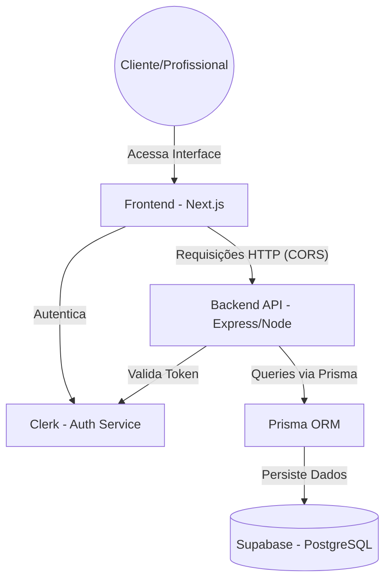
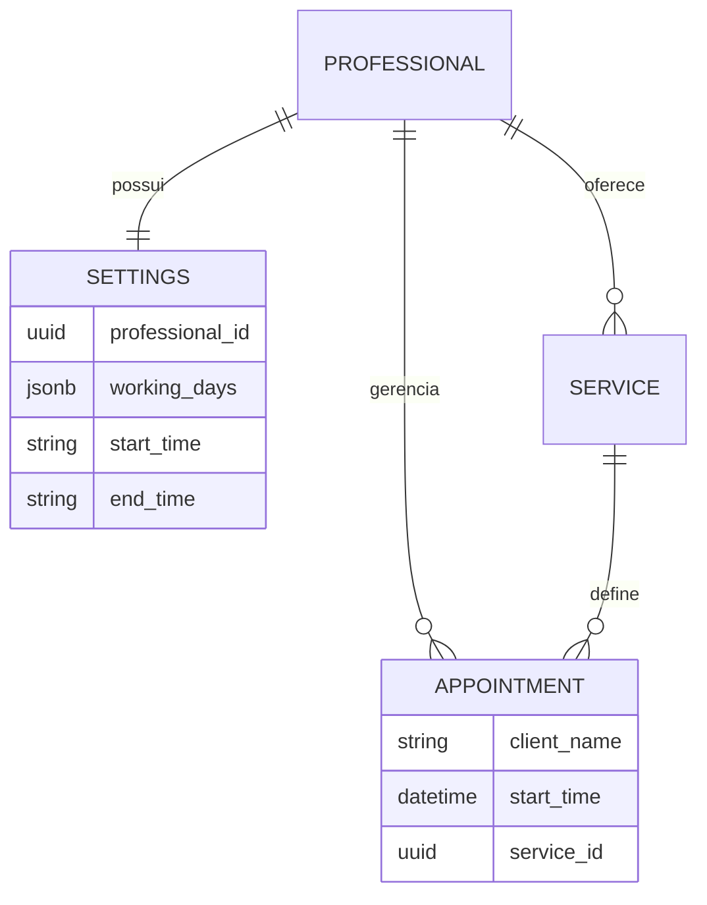

# Especificação Técnica

## 1. Visão Geral Técnica
A presente Especificação Técnica do Produto estabelece as diretrizes arquiteturais, stack tecnológica padrão e regras de segurança para o desenvolvimento do **Gerenciador de Agendamentos Inteligente (MVP - v1)**. 

O objetivo deste documento é servir como um guia definitivo para o desenvolvimento, garantindo consistência, escalabilidade e manutenção facilitada do código através de uma arquitetura moderna e segura baseada em microsserviços na nuvem.

---

## 2. Arquitetura de Referência (C4 Model)

A aplicação adota uma arquitetura híbrida focada em agilidade e padronização:
- **Desenvolvimento Local:** Utiliza **Docker e Docker Compose** para orquestração de serviços, garantindo paridade de ambiente entre desenvolvedores.
- **Produção (Stable/Preview):** Utiliza arquitetura **Serverless PaaS na Vercel**, visando escalabilidade total e baixa manutenção.

A estrutura é baseada no modelo de **Recipientes (Containers)**, com separação clara:

* **Estilo Arquitetural:** Monorepo com Microsserviços Serverless.
* **Componentes Principais:**
    * **Client Layer (Frontend):** Aplicação Next.js consumindo API via HTTP. Renderização híbrida (SSR para a booking page, CSR para o Dashboard).
    * **Data/API Layer (Backend):** Servidor Node.js rodando Express.js, operando como Serverless Functions na Vercel.
    * **Database Provider:** Banco de dados relacional gerenciado na nuvem (Supabase).
* **Infraestrutura de Deployment:** CI/CD automatizado via GitHub Actions realizando o deploy integrado para a Vercel.
* **Padronização Local:** Docker Compose para execução simultânea do Frontend (Next.js) e Backend (Express).

### Especificidades de Infraestrutura na Nuvem
* **Comunicação Cross-Origin:** A API do Backend possui políticas estritas de CORS configuradas (com suporte a *credentials*) para aceitar requisições exclusivamente do domínio de produção do Frontend.
* **Compatibilidade de Banco de Dados:** O Prisma ORM está configurado com `binaryTargets` específicos (`rhel-openssl-3.0.x`) para garantir a execução e compatibilidade do Query Engine no ambiente Linux Serverless da Vercel.

---

## 3. Stack Tecnológica

### Frontend
* **Linguagem:** TypeScript
* **Framework web:** Next.js 14+ (React)
* **Estilização:** Tailwind CSS (Mobile-First)

### Backend e Persistência
* **Linguagem:** TypeScript
* **Runtime:** Node.js (Vercel Serverless Functions)
* **Framework API:** Express.js
* **Persistência:** PostgreSQL (Supabase)
* **ORM:** Prisma ORM

### Stack de Desenvolvimento e DevOps
* **IDE:** VS Code
* **Gerenciamento de pacotes:** npm
* **Pipeline CI/CD:** GitHub Actions (Scripts customizados de deploy para Vercel).
* **Hospedagem de Produção:** Vercel (Frontend e Backend).
* **Ambiente de Desenvolvimento:** Docker & Docker Compose (Padrão local).

---

## 4. Segurança

### Autenticação e Gestão de Sessão
A aplicação delega a gestão de identidade ao **Clerk**, garantindo fluxos seguros de login (incluindo Google Auth) e proteção de rotas administrativas via Middleware no Frontend e validação de tokens no Backend.

### Controle de Acesso e Autorização 
O isolamento de dados é garantido pela chave **professional_id**. O sistema valida em cada requisição se o usuário autenticado possui permissão para acessar ou modificar os registros solicitados.

### Segurança de Dados e Validação
* **Criptografia:** Todo tráfego é criptografado via HTTPS/TLS. Dados em repouso são protegidos pela infraestrutura do Supabase.
* **Sanitização:** Uso de tipos estritos em TypeScript para prevenir inconsistências e validação de esquemas no recebimento de dados via endpoints.

---

## 5. APIs e Comunicação
A comunicação entre Cliente e Servidor segue o padrão REST.

### Endpoints Principais
* `POST /appointments`: Criação de novos agendamentos (clientes) e inserção de bloqueios manuais (profissional).
* `GET /appointments`: Recuperação da lista de compromissos filtrada por data e profissional.
* `GET /api/health`: Rota de verificação de status e integridade do Backend.

---

## 6. Tenancy
* **Estratégia:** Arquitetura *Multi-Tenant* (Single Database, Shared Schema).
* **Isolamento:** A separação lógica é feita via `professional_id`. O sistema foi projetado para que cada profissional gerencie apenas sua própria grade, sem interferência em outros perfis.
* **Segurança:** Filtros obrigatórios em todas as queries SQL/Prisma baseados na identidade do profissional logado.

---

## 7. Modelo de Dados (ERD)

---

## 8. Diretrizes para Desenvolvimento Assistido por IA
1.  **Tipagem Estrita:** A IA deve sempre gerar interfaces TypeScript e evitar o tipo `any`.
2.  **Modularização:** Manter componentes de interface separados da lógica de acesso ao banco de dados.
3.  **Sincronia com PRD:** Toda nova implementação sugerida pela IA deve ser validada contra os requisitos definidos no documento de PRD.