# Especificação de Interface do Usuário (UI)

## 1. Protótipos e Telas de Alta Fidelidade (Mockups)

Para garantir a melhor experiência de usuário (UX) e atender aos requisitos de responsividade (Mobile-First), as interfaces foram prototipadas e validadas. Abaixo estão as representações visuais (mockups de alta fidelidade) das principais telas do sistema em funcionamento.

> **Nota para o Avaliador:** Como a aplicação já ultrapassou a fase de Discovery e encontra-se funcional (MVP), apresentamos abaixo as telas reais em alta fidelidade que substituem os wireframes iniciais.

### 1.1 Visão do Profissional (Dashboard)
*(Representação da INT-04 - Controle de agenda e bloqueios)*

> **Ação Necessária (Andre):** Tire um print da sua tela de Dashboard, salve com o nome `dashboard_mockup.png` e coloque dentro da sua pasta `docs/design/`.

### 1.2 Visão do Cliente (Booking Page)
*(Representação da INT-01 - Seleção de data, horário e lead time)*

---

## 2. Interfaces Gráficas (Especificação de Componentes)

Abaixo listamos as especificações detalhadas das interfaces desenvolvidas para o MVP (v1), divididas entre a visão do Cliente Final (pública) e a visão do Profissional (privada/autenticada).

### INT-01 - Página de Agendamento Pública (Booking Page)
* **Tipo de contêiner:** Página Web (Mobile-first)
* **Campos:** * Header de Perfil (Avatar/Foto, Nome do Profissional e Título da Profissão - ex: "Carlos Eletricista").
  * Seleção de Data (Calendário simplificado).
  * Seleção de Horário (Botões/pílulas dinâmicas. Horários ocupados ou bloqueados ficam indisponíveis/cinzas).
  * Nome Completo (Input text).
  * WhatsApp (Input text com máscara de telefone).
  * Serviço Desejado (Dropdown populado dinamicamente com os serviços do profissional, ocultando automaticamente serviços administrativos de bloqueio).
  * Endereço / Observações (Textarea).
* **Botões:** `Confirmar Agendamento` (CTA com cor de destaque).
* **Considerações:** O design deve ser extremamente limpo, focado na conversão, sem distrações.

### INT-02 - Tela de Confirmação de Agendamento (Success Page)
* **Tipo de contêiner:** Página de Sucesso.
* **Campos:** Resumo do agendamento (Nome do serviço, Data, Horário).
* **Links:** `Adicionar ao meu Calendário` | `Voltar para o Início`.
* **Considerações:** Deve exibir um Ícone de Check para transmitir segurança ao cliente de que a reserva foi efetivada instantaneamente na agenda.

### INT-03 - Tela de Login do Profissional
* **Tipo de contêiner:** Formulário de Autenticação Centralizado.
* **Botões:** `Entrar com Google` (Social Login via Clerk).
* **Considerações:** Acesso rápido e seguro, sem necessidade de digitação de senhas complexas no mobile.

### INT-04 - Dashboard Principal (Minha Agenda)
* **Tipo de contêiner:** Painel de Controle Administrativo.
* **Campos:** * Abas de navegação interna (`Próximos` / `Histórico`).
  * Lista de Cards de Agendamento: Exibe horário, nome do cliente, serviço e endereço.
  * **Identificador de Bloqueio:** Cards referentes a compromissos pessoais recebem estilo visual distinto (ícone de cadeado, cor acinzentada, título "🔒 BLOQUEIO PESSOAL") e não exibem botões de contato.
* **Botões:** * `Bloquear` (Abre a INT-06).
  * `Link` (Copia a URL pública de agendamento).
  * Ações no Card: `Concluir`, `Cancelar`, `WhatsApp`.

### INT-05 - Configuração de Disponibilidade e Serviços (Settings)
* **Tipo de contêiner:** Formulário Dinâmico.
* **Campos (Horários):** Checkboxes (Segunda a Domingo), inputs de tempo para Início/Término do Expediente e Pausa de Almoço.
* **Campos (Serviços):** Lista de cartões com os serviços cadastrados (Nome e Duração).
* **Botões:** `+ Adicionar Novo` | Ícone de Lixeira | `Salvar Configurações`.

### INT-06 - Modal de Bloqueio Pessoal
* **Tipo de contêiner:** Modal (Overlay sobre o Dashboard).
* **Campos:** Data do Bloqueio (Datepicker) | Selecione os Horários (Grid de botões).
* **Botões:** `Confirmar Bloqueio`, `Cancelar`.

### INT-07 - Gestão de Clientes (Meus Clientes)
* **Tipo de contêiner:** Página de Listagem.
* **Campos:** Barra de busca | Cards de Clientes.
* **Botões:** Ícone de Balão de Mensagem (Redireciona para o WhatsApp).

---

## 3. Fluxo de Navegação (User Flow)

O diagrama abaixo ilustra o mapeamento do percurso do usuário, descrevendo como as personas transitam pelas principais funcionalidades arquitetadas na Seção 2.

```mermaid
graph TD
    %% Estilos
    classDef cliente fill:#10B981,stroke:#047857,stroke-width:2px,color:#fff
    classDef prof fill:#3B82F6,stroke:#1D4ED8,stroke-width:2px,color:#fff
    classDef tela fill:#F3F4F6,stroke:#6B7280,stroke-width:1px,color:#000
    classDef acao fill:#ffffff,stroke:#9CA3AF,stroke-width:1px,stroke-dasharray: 5 5

    %% Jornada do Cliente Final
    subgraph "👤 Fluxo do Cliente Final (Público)"
        A[Link no Instagram/WhatsApp]:::cliente -->|Acessa URL| B(INT-01: Booking Page):::tela
        B --> C{Escolhe Data e Hora}:::acao
        C -->|Preenche Form| D(Confirmar Agendamento):::acao
        D -->|Redireciona| E(INT-02: Success Page):::tela
        E -->|Fim do Fluxo| F[Redireciona WhatsApp do Profissional]:::cliente
    end

    %% Jornada do Profissional
    subgraph "🛠️ Fluxo do Profissional (Privado)"
        G[Acesso ao Sistema]:::prof -->|Redireciona| H(INT-03: Login Clerk):::tela
        H -->|Autenticação| I(INT-04: Dashboard Principal):::tela
        
        I -->|Ação Rápida| J(INT-06: Modal de Bloqueio):::tela
        I -->|Menu Lateral| K(INT-05: Ajustes e Serviços):::tela
        I -->|Menu Lateral| L(INT-07: Lista de Clientes):::tela
    end
```

---

## 4. Diretrizes para Desenvolvimento e IA
1. **Clean UI & Acessibilidade:** Foco absoluto em interfaces minimalistas (estilo Apple/Stripe). Priorizar uso de whitespace e contraste visual.
2. **Componentização (Atomic Design):** Interfaces não devem ser geradas em arquivos `.tsx` monolíticos. A IA deve isolar formulários, cards e modais em sub-componentes independentes.
3. **Responsividade (Mobile-First):** Cada fragmento de design (Tailwind classes) deve ser validado para funcionamento impecável em telas estreitas, priorizando a usabilidade touch (botões grandes, espaçamentos generosos).
4. **Tratamento de Estado:** A aplicação (e as rotinas geradas por IA) devem implementar feedbacks visuais imediatos (loading spinners, `disabled states` em botões, *toast notifications* de sucesso/erro) durante as requisições ao Supabase.